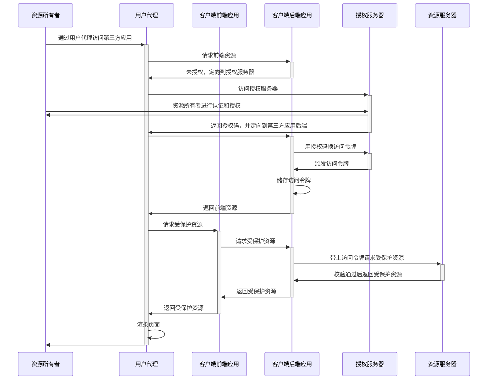

## 概述

在传统的客户端——服务器身份认证模型中，客户端通过使用资源所有者的凭证与服务器进行身份认证，以此来请求服务器上的受保护资源。为了让第三方应用程序也能访问受保护资源，资源所有者不得不与第三方共享其凭证。这就产生了一些问题和限制：

- 第三方应用程序需要存储资源所有者的凭证以备将来使用，而凭证通常是明文的密码
- 要求服务器都能支持密码身份认证，尽管密码本身存在安全缺陷
- 资源所有者没有能力限制第三方应用程序对受保护资源的访问范围和访问持续时间，因此第三方应用程序可以一直无限制地访问受保护资源
- 资源所有者必须要通过修改密码的方式来撤销第三方的访问权限，而且这种方式会撤销所有第三方应用程序的访问权限，无法做到撤销指定的第三方的访问权限
- 任何第三方应用程序的泄露都会导致最终用户的密码和受该密码保护的所有数据的泄露

`OAuth`通过引入授权层并分离客户端角色与资源所有者角色来解决这些问题。在`OAuth`中，受保护资源由资源服务器托管，由资源所有者控制客户端请求访问，并颁发给客户端不同于资源所有者的凭证——访问令牌(access token)。访问令牌表示特定范围、生存期和其他访问属性的字符串，是授权服务器颁发给第三方客户端的。有了访问令牌之后客户端访问由资源服务器托管的受保护资源时就可以使用访问令牌而不是资源所有者的凭证（如账号密码）。

一句话总结，**`OAuth`的本质就是通过限制第三方应用的访问能力，解决了信息泄露的问题，达到安全灵活的目的。**

想象一个场景，你用微信登录极客时间，这个时候会跳转到微信的登录界面，你成功登录微信之后，会有一个授权界面，该界面提示：极客时间申请使用你的微信头像、昵称、地区等信息，还有同意和拒绝的按钮，当你点击同意按钮，界面就会跳回到极客时间，极客时间就会知道你已经成功从微信登录并且获取了你的微信头像、昵称、地区等信息。


在这里，极客时间就是第三方客户端，微信就是资源服务器，你就是资源所有者，你的微信头像、昵称、地区信息就是受保护的访问信息。

如果没有`OAuth`，你就只能极客时间输入微信的账号密码，极客时间就有可能把你的明文密码储存起来，一旦极客时间不小心泄露了你微信的账号密码，你微信的所有信息就被泄露了，不单你的微信头像、昵称、地区信息，还有聊天记录等敏感信息都会被泄露。而且你不能限制极客时间对你微信信息的访问范围，你授权的信息只有微信头像、昵称、地区，但极客时间已经掌握了你的账密，它要访问你的聊天记录也是可以的，同时极客时间可以永远访问这些信息。你只能通过修改微信密码来撤销对极客时间的授权，但你一旦修改密码，其他之前获得你授权的第三方应用也会被撤销授权。

有了`OAuth`之后，你是跳转到微信服务器去登录微信的，你的微信账号和密码不会泄露给极客时间，并且极客时间也只能获取你所授权的有限信息，授权也是是有期限的，也就是说极客时间不能一直拿着你给它的授权去微信服务器获取你的信息，等授权过期后，需要你再登录一次微信去授权。

[`OAuth 1.0`](https://tools.ietf.org/html/rfc5849)是最早提出`OAuth`概念的协议，[`OAuth 2.0`](https://tools.ietf.org/html/rfc6749)基于`OAuth 1.0`做了相当多的改进，但`OAuth 2.0`协议与`OAuth 1.0`协议共享的实现细节很少，而且`OAuth 2.0`协议与`OAuth 1.0`不向后兼容，这两个版本可能在网络上共存，实现可能选择同时支持这两个版本。

在stackoverflow上有个关于`OAuth 2.0`与`OAuth 1.0`有何不同的提问——[How is OAuth 2 different from OAuth 1?](https://stackoverflow.com/questions/4113934/how-is-oauth-2-different-from-oauth-1)，总结起来就是：

- `OAuth 2.0`支持更多的`OAuth`流，对基于非浏览器的应用程序更友好
- `OAuth 2.0`不再要求客户端应用程序具有加密功能，因为使用`OAuth 2.0`，应用程序只能带上颁发的令牌通过HTTPS来发出请求
- `OAuth 2.0`签名要简单得多
- `OAuth 2.0`访问令牌是“短暂的”
- `OAuth 2.0`将负责处理OAuth请求的服务器与负责处理用户授权的服务器之间的角色完全分开

## 角色

`OAuth 2.0`定义了4种角色：

- 资源所有者

  能够授权访问受保护资源的实体。当资源所有者是人时，它被称为终端用户。
  
- 资源服务器
  
  托管受保护资源的服务器，能够接受并响应对受保护的资源的请求，前提是该请求需带上访问令牌。
  
- 客户端

  代表资源所有者及其授权发出受保护资源请求的应用程序。术语“客户端”并不意味着任何特定的实现特征(例如，应用程序是否在服务器、桌面或其他设备上执行)。

- 授权服务器

  在资源所有者认证成功并授权客户端后，向客户端颁发访问令牌的服务器。

## 授权流程

4种角色之间的交互过程如下图，其中资源服务器和授权服务器可以是同一个

```
     +--------+                               +---------------+
     |        |--(A)- Authorization Request ->|   Resource    |
     |        |                               |     Owner     |
     |        |<-(B)-- Authorization Grant ---|               |
     |        |                               +---------------+
     |        |
     |        |                               +---------------+
     |        |--(C)-- Authorization Grant -->| Authorization |
     | Client |                               |     Server    |
     |        |<-(D)----- Access Token -------|               |
     |        |                               +---------------+
     |        |
     |        |                               +---------------+
     |        |--(E)----- Access Token ------>|    Resource   |
     |        |                               |     Server    |
     |        |<-(F)--- Protected Resource ---|               |
     +--------+                               +---------------+
     			Figure 1: Abstract Protocol Flow
```

- (A) 客户端向资源所有者请求授权。授权请求的形式可以是客户端直接向资源所有者发出请求（如上图），也可以通过授权服务器作为中介间接进行（如极客时间的例子）。
- (B) 客户端接收到资源服务器颁发的授权许可，这个授权许可是表示资源所有者授权的凭证，凭证可以使用规范中定义的四种授权许可类型之一或扩展类型表示。[授权许可类型](#授权模式)取决于客户端请求授权使用的方法和授权服务器支持的类型。
- (C) 客户端通过授权服务器进行身份验证并提供授权许可来请求访问令牌。
- (D) 授权服务器对客户端进行身份验证并验证授权授予，如果有效，则颁发访问令牌。
- (E) 客户端从资源服务器请求受保护的资源，并通过提供访问令牌进行身份验证。
- (F) 资源服务器验证访问令牌，如果有效，则为请求提供服务。

客户端从资源所有者获取授权许可（步骤A、B）的首选方法应该是利用授权服务器作为中介，如[Figure 2](#授权码模式)。

## 授权模式

在客户端获取访问令牌前，首先要获取授权许可，授权许可是代表资源所有者授权（访问受保护资源的授权）的凭证。`OAuth 2.0`定义了4种授权许可类型——授权码许可、隐式许可、资源所有者密码凭证许可、客户端凭证许可。这4种授权许可类型对应着4种授权模式——授权码模式，隐式授权模式、

### 授权码模式

授权码许可是通过授权服务器作为客户端和资源所有者之间的中介获取的。客户端不直接从资源所有者请求授权，而是将资源所有者定向到授权服务器(通过[RFC2616](https://tools.ietf.org/html/rfc2616)中定义的`user-agent`)，授权服务器又用授权码将资源所有者定向回客户端。

授权服务器在使用授权码将资源所有者定向回客户端之前，需要对资源所有者进行身份验证并获得授权。由于资源所有者只与授权服务器进行身份验证，因此资源所有者的凭证永远不会与客户端共享。

授权码提供了一些重要的安全好处，例如能够对客户端进行身份验证，以及将访问令牌直接传输到客户端，而无需通过资源所有者的`user-agent`传递它，并可能将其公开给其他人，包括资源所有者。

下图是授权码授权机制的流程，由于这是一个基于重定向的流，因此客户端必须能够与资源所有者的用户代理(通常是web浏览器)交互，并能够接收来自授权服务器的传入请求(通过重定向)。

```
     +----------+
     | Resource |
     |   Owner  |
     |          |
     +----------+
          ^
          |
         (B)
     +----|-----+          Client Identifier      +---------------+
     |         -+----(A)-- & Redirection URI ---->|               |
     |  User-   |                                 | Authorization |
     |  Agent  -+----(B)-- User authenticates --->|     Server    |
     |          |                                 |               |
     |         -+----(C)-- Authorization Code ---<|               |
     +-|----|---+                                 +---------------+
       |    |                                         ^      v
      (A)  (C)                                        |      |
       |    |                                         |      |
       ^    v                                         |      |
     +---------+                                      |      |
     |         |>---(D)-- Authorization Code ---------'      |
     |  Client |          & Redirection URI                  |
     |         |                                             |
     |         |<---(E)----- Access Token -------------------'
     +---------+       (w/ Optional Refresh Token)

   Note: The lines illustrating steps (A), (B), and (C) are broken into
   two parts as they pass through the user-agent.

                     Figure 2: Authorization Code Flow
```

- (A) 客户端通过将资源所有者的user-agent定向到授权端点来开启此流程。客户端需要带上它的客户机标识符、请求的范围、本地状态和一个重定向URI参数，授权服务器在授予(或拒绝)访问权限后将把user-agent发送回该重定向URI。
- (B) 授权服务器(通过user-agent)对资源所有者进行身份验证，并向资源所有者确认是否授予或拒绝客户机的访问请求。
- (C) 假设资源所有者授予了访问权，授权服务器使用前面提供的重定向URI(在请求中或在客户端注册期间)将user-agent重定向回客户机。重定向URI包括一个授权码和前面客户端提供的本地状态。
- (D) 客户端带上在上一步中接收到的授权码和用于获取授权码的重定向URI，从授权服务器的令牌端点请求访问令牌。客户端请求授权时，需要与授权服务器进行身份验证。
- (E) 授权服务器对客户端进行认证，验证授权码，并确保接收到的重定向URI与步骤(C)中用于重定向客户端的URI匹配。如果所有校验都通过，授权服务器将颁发一个访问令牌和一个刷新令牌(可选)。

**这里客户端可以细分为前端和后端，因为只有访问令牌只能在客户端应用后端和授权服务器之间传递，才能保证不暴露给其他方（包括用户代理）。用户代理拿到的是授权码，然后带着授权码定向到客户端应用后端，客户端应用后端再用授权码换访问令牌，这样就能保证访问令牌不会泄露。**

下图是更详细的交互时序图：




### 隐式许可模式

隐式许可模式是授权码模式的简化版。隐式许可也就是没有许可，客户端不需要中间许可（例如授权码），直接向授权服务器请求获取访问令牌(但不支持获取刷新令牌)，并针对已知操作特定重定向URI的公共客户端进行了优化。这些客户端通常在浏览器中使用脚本语言(如JavaScript)实现。

隐式许可模式不包括客户端身份验证，并且需要事先向授权服务器注册重定向URI。因为访问令牌被编码到重定向URI中，所以它会暴露给资源所有者和驻留在同一设备上的其他应用程序。

隐式许可模式提高了一些客户端的响应性和效率，因为它减少了获取访问令牌所需的往返次数。但是，这种便利会带来安全隐患，特别是当授权码模式可用时，应该从安全影响角度进行权衡。

下图是隐式许可模式的流程，由于这是一个基于重定向的流，因此客户端必须能够与资源所有者的用户代理(通常是web浏览器)交互，并能够接收来自授权服务器的传入请求(通过重定向)。

```
     +----------+
     | Resource |
     |  Owner   |
     |          |
     +----------+
          ^
          |
         (B)
     +----|-----+          Client Identifier     +---------------+
     |         -+----(A)-- & Redirection URI --->|               |
     |  User-   |                                | Authorization |
     |  Agent  -|----(B)-- User authenticates -->|     Server    |
     |          |                                |               |
     |          |<---(C)--- Redirection URI ----<|               |
     |          |          with Access Token     +---------------+
     |          |            in Fragment
     |          |                                +---------------+
     |          |----(D)--- Redirection URI ---->|   Web-Hosted  |
     |          |          without Fragment      |     Client    |
     |          |                                |    Resource   |
     |     (F)  |<---(E)------- Script ---------<|               |
     |          |                                +---------------+
     +-|--------+
       |    |
      (A)  (G) Access Token
       |    |
       ^    v
     +---------+
     |         |
     |  Client |
     |         |
     +---------+

   Note: The lines illustrating steps (A) and (B) are broken into two
   parts as they pass through the user-agent.

                       Figure 3: Implicit Grant Flow
```

- (A) 客户端通过将资源所有者的user-agent定向到授权端点来开启流程。客户机需要带上它的客户端标识符、请求的范围、本地状态和一个重定向URI，授权服务器在授予(或拒绝)访问权限后将把user-agent发送回该重定向URI。
- (B) 授权服务器(通过user-agent)对资源所有者进行身份验证，并确定资源所有者是否授予或拒绝客户机的访问请求。
- (C) 假设资源所有者授予了访问权，授权服务器使用前面提供的重定向URI将user-agent重定向回客户端。访问令牌包含于重定向URI锚点中。
- (D) user-agent根据重定向指令，向web托管的客户端资源发出请求，注意此时user-agent没有带上URI锚点信息。
- (E) web托管的客户端资源返回一个web页面(通常是一个带有嵌入式脚本的HTML文档)，它能够访问完整的重定向URI，包括由user-agent保留的锚点信息，并提取锚点信息中包含的访问令牌(和其他参数)。
- (F) user-agent在本地执行由web托管的客户端资源提供的脚本，该脚本提取访问令牌。
- (G) user-agent将访问令牌传递给客户端。

**注意，步骤C中令牌的位置是 URL 锚点`#`（fragment），而不是查询字符串`?`（querystring），这是因为 OAuth 2.0 允许跳转网址是 HTTP 协议，因此存在"中间人攻击"的风险，而浏览器跳转时，锚点不会发到服务器，就减少了泄漏令牌的风险。还有流程图中的`web-hosted client resource`很多人不理解是什么意思，web-hosted其实就是网络托管（一般情况其实就是服务器托管），我们在浏览器访问的页面其实是托管在服务器的，可以简单理解为`web-hosted client resource`就是第三方应用的后端，`client`就是第三方应用的前端（若这个第三方应用是没有后端的，可以直接在前端写脚本解析URI的锚点信息，具体可参考Stack Overflow上的问题[Why does the Implicit Authorization Grant in OAuth require a “Web-hosted Client Resource”?](https://stackoverflow.com/questions/23780909/why-does-the-implicit-authorization-grant-in-oauth-require-a-web-hosted-client)）。所以步骤D是授权服务器将user-agent重定向到第三方应用后端，在步骤E中后端再将解析解析URI锚点信息的脚本返回给前端。**

### 资源所有者密码凭证模式

资源所有者密码凭证(即用户名和密码)可以直接用作授权许可，以获得访问令牌。只有当资源所有者和客户端之间存在高度信任时(例如，客户端是设备操作系统的一部分或具有高度特权的应用程序)，以及当其他授权许可类型不可用时(例如授权码)，这种模式才应该使用。

尽管这种模式要求客户端直接获取资源所有者的凭证，但凭证只用于单个请求，并用凭证交换为访问令牌。通过用凭证交换长时间的访问令牌或刷新令牌，即使将来还有访问受保护资源的需求，客户端也不用存储凭证以防泄露。

```
     +----------+
     | Resource |
     |  Owner   |
     |          |
     +----------+
          v
          |    Resource Owner
         (A) Password Credentials
          |
          v
     +---------+                                  +---------------+
     |         |>--(B)---- Resource Owner ------->|               |
     |         |         Password Credentials     | Authorization |
     | Client  |                                  |     Server    |
     |         |<--(C)---- Access Token ---------<|               |
     |         |    (w/ Optional Refresh Token)   |               |
     +---------+                                  +---------------+

            Figure 4: Resource Owner Password Credentials Flow
```

- (A) 资源所有者向客户机提供其用户名和密码。
- (B) 客户端带上从资源所有者接收到的凭证，从授权服务器的令牌端点请求访问令牌。客户端请求授权时，需要与授权服务器进行身份验证。
- (C) 授权服务器对客户机进行身份验证并验证资源所有者凭证，如果有效，则发出访问令牌。

### 客户端凭证模式

当授权范围仅限于客户端控制下的受保护资源或之前与授权服务器安排的受保护资源时（这种方法超出了`OAuth 2.0`的范围），客户端可以仅使用客户端凭证(或其他形式的客户端身份验证)作为授权许可请求访问令牌。仅当客户端以自己的名义行事(客户端也是资源所有者)或根据之前与授权服务器安排的授权请求访问受保护的资源时，客户端凭证才可以用于授权许可。

```
     +---------+                                  +---------------+
     |         |                                  |               |
     |         |>--(A)- Client Authentication --->| Authorization |
     | Client  |                                  |     Server    |
     |         |<--(B)---- Access Token ---------<|               |
     |         |                                  |               |
     +---------+                                  +---------------+

                     Figure 5: Client Credentials Flow
```

- (A) 客户端使用授权服务器进行身份验证，并从令牌端点请求访问令牌。
- (B) 授权服务器对客户端进行身份验证，如果有效，则发出一个访问令牌。

> 参考文献
>
> - [理解OAuth 2.0](https://www.ruanyifeng.com/blog/2014/05/oauth_2_0.html)
> - [RFC-6749](https://tools.ietf.org/html/rfc6749)